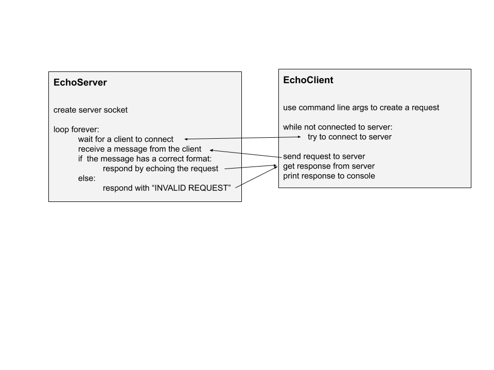
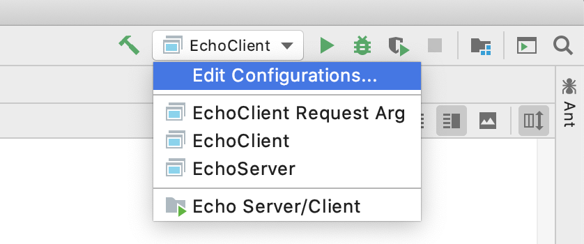
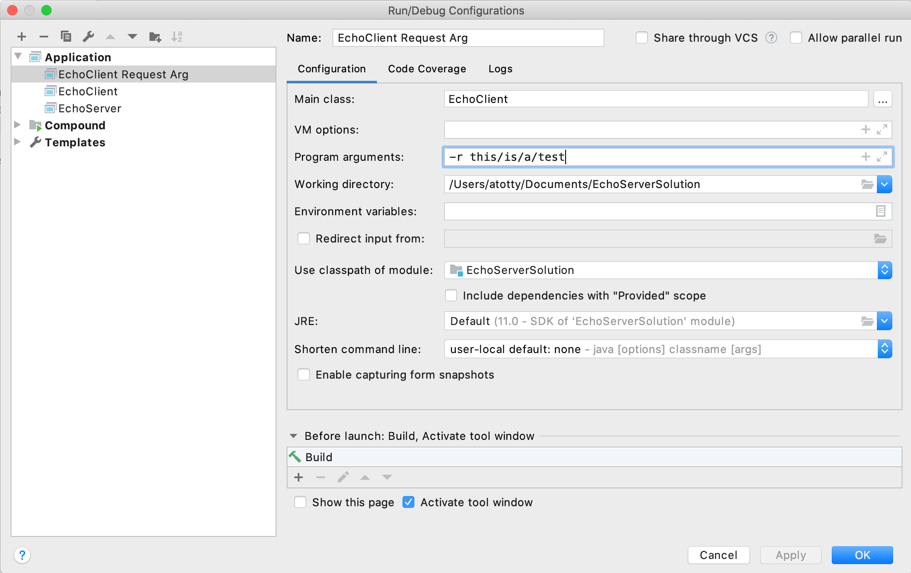

# Project 4: EchoServer

**Hypertext Transfer Protocol (HTTP)** is a protocol (set of rules) that defines how web servers and web clients (e.g. web browsers) can share and modify data. Web clients that follow this protocol use keywords to request servers take certain actions on their behalf, such as modifying values in a database, or deleting resources maintained by the server. The protocol defines many more services than these, and, collectively, these have built the web you use every day. You can read more about the history of HTTP [here](https://developer.mozilla.org/en-US/docs/Web/HTTP/Basics_of_HTTP/Evolution_of_HTTP). 

In this project you will implement a protocol that emulates some elements of the HTTP. In particular, you will write server code that reads a requests from a client, parses the quests and validates its format, then responds to the client with a message. This basic functionality is the foundation of a server that sends data like web pages to web browsers. Here, you will be making what is often called an "echo" server, as valid requests are simply echoed by the server back to the client. 

## Project Files
This project consists of two files, described below. 
- **EchoClient.java**: This program represents a resource client. You might imagine much of this program the part of a web browser that connects to a server and requests web page data. The client connects to a server, sends a request message, receives a response from the server, and prints that response before terminating. **This class requires one small addition.** 
- **EchoServer.java**: This program represents a server listening for content requests. Upon connecting with a client, the server waits to receive a request message from that client, parses that request, and sends an appropriate response. **This class requires significant additions.** 

The following diagram illustrates how the server and client relate. 

 

## Things That Already Work
Much of the functionality of the server and clients is already complete. You should read the following section to understand how the programs interact, but you do not need to modify the code that produces the behavior described here.  

### Command Line Options
Both the server and the client are designed to be run from the command line, and they each support a set of command line options. A full description of the options can be seen by passing `--help` or `-h` as an argument. In IntelliJ IDEA, you may specify command line arguments in the Run/Debug Configurations menu.  

- Select the Run/Debug dropdown menu. 
 
- Edit the "Program arguments" field. 
 

Alternatively, you may simply edit relevant variable values in the source code of client and server.  

### Interprocess Communication (IPC) 
The server and client create socket objects (`Socket` and `ServerSocket`) which represent communication channels. Messages are passed between the client and server via streams of data (`ObjectInputStream` and `ObjectOutputStream`) that are fields of the socket objects. Each program sends data to its peer by writing that data to their own `ObjectOutputStream` and receives data from its peer through its `ObjectInputStream`. 

## Your Task
Your job in this project is to implement the Echo protocol in `EchoServer` and `EchoClient`. Comments of the form 

    TODO: STUDENT WORK 

indicate where you should add and/or modify code. The Echo protocol is defined as follows: 
- Messages requesting a resource must be a string of the form `"GET /path/to/resource"` to be considered syntactically valid.
    - The message must include the request method `GET` followed by exactly one space to be considered valid. 
    - `"/path/to/resource"` is a file path describing the requested resource and can have any number of forwardslashes separated by strings. 
    - The path of the requested resource must begin with a forwardslash to be considered valid. 
    - The path of the requested resource cannot have any consecutive forwardslashes to be considered valid. 
    - The path of the requested resource may or may not end in a forwardslash (either is considered valid). 
    - The path of the requested resource should not contain spaces without being escaped (i.e. `"\ "`) to be considered valid.
- The server responds to invalid requests by sending the client the message `"INVALID"`. 
- The server responds to valid requests by sending the client the message `"You requested /path/to/resource"`.   
 
## Evaluation
Your project submission will be evaluated as follows. 
- (5 pts.) Both `EchoServer` and `EchoClient` compile without errors. 
- (10 pts.) `EchoServer` correctly echos valid requests from `EchoClient`. 
- (10 pts.) `EchoServer` sends the message `"INVALID"` for requests with malformed methods. 
- (10 pts.) `EchoServer` sends the message `"INVALID"` for requests with malformed paths.
- (5 pts.) You have completed student_readme.md to describe your approach to solving the problems you encountered while completing the project. This need not be a diary, but your approach should be clearly explained here.
    - What challenges did you face while completing the project? How did you address them?  
    - How did you test your code? Explicitly describe examples of your test cases. 
    - (Bonus 2 pts.) Provide suggestions of how you would improve the documentation, sample code, testing, or other aspects of the project (up to 2 points extra credit available for noteworthy suggestions here, e.g., actual descriptions of how you would change things, sample code, code for tests, etc.) You will not receive bonus points for simply reporting an issue - you should provide actionable suggestions on how to improve things   
    
## Optional Challenge
Extend the Echo protocol to transfer files from the server to the client. The `resources/server` folder contains two files you may use as examples in developing this functionality. If the client requests `/small.txt` or `/medium.txt`, the server should respond not by echoing the request, but rather by sending the actual file contents to the client. The client may use the folder `resources/client` to write what it receives.     

## Submission, AI, Late Policy
Please submit your project as a compressed folder __containing the entire project__ (i.e. not just the `src` folder) and submit it to the dropbox associated with the project assignment.  

This project is a solo project and should contain a representation of your understanding of the content. If you use an idea from another source (content or styling from another website, classmate, etc.) you must cite that source. Failure to do so is considered an AI violation. 

Late work will be accepted with a penalty of 5% for each day the submission is late (up to a maximum 30% penalty). 
    

